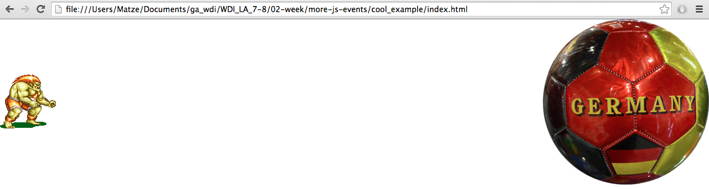

#More JavaScript Events
=======================
Congrats on completing week 1. You showed great understanding of JavaScript events past Friday. Today we'll be having some more fun using plain JavaScript events.

Your cohort picked Blanka as your favorite Street Fighter 2 character. Given the humiliation of the host country in the concluded World Cup (talking about the fascinating game of Soccer), I pivoted on my original idea and came up with a JavaScript events example which you'll find in the **cool_example** folder.

##The example code
Loading the index.html in your Google Chrome browser, you should see a screen similar to this.

###JavaScript events in .js
Looking at the html source code, you'll see that there are no on*event* attributes in any of the html elements. However, a click on the ball will trigger it moving towards the left side of the window. This and other behaviors are defined in the embedded JavaScript file.

**Warning: There's sound!**

Feel free to refactor, modify and extend the JavaScript file to make this example code into a project of your own.

###CSS animation
For convenience I've modified the original blanka_original.png file to define fixed width sprites (130px wide) in blanka_edited.png. The fixed width of the "sprites" allows us to use the webkit-animation and webkit-keyframes classes to easily animate the Brazilian Beast. Use your resources to find out how we would achieve browser compatibility.

===

##What to do with it

Here are some suggestions:

* study the code
* refactor
* play with it
* insert a goal image
* make a counter for goals
* make Blanka move up/down by using the up/down arrow keys
* make it possible for Blanka to reject the Ball by punching or kicking it
* randomize the initial position and movement of the ball
* rotate the ball
* create an "AI"-controlled German player to dribble and kick the ball
* ...
